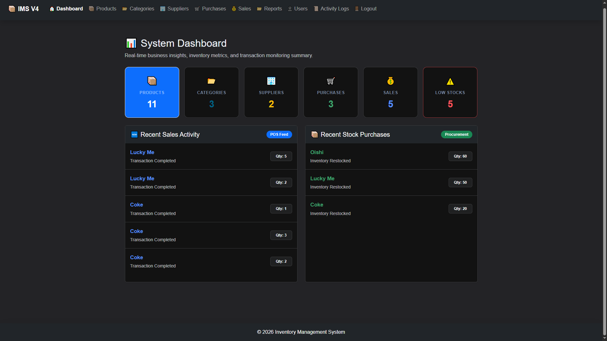
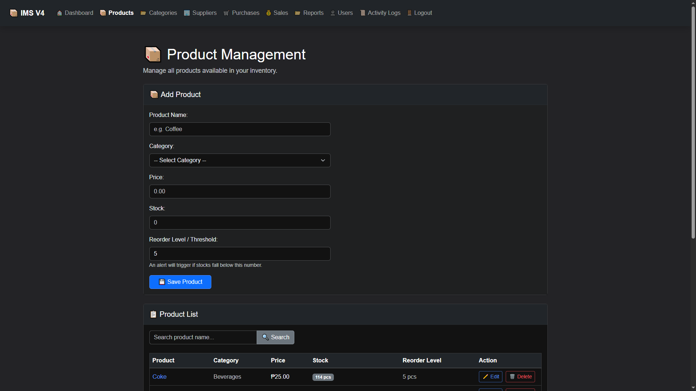
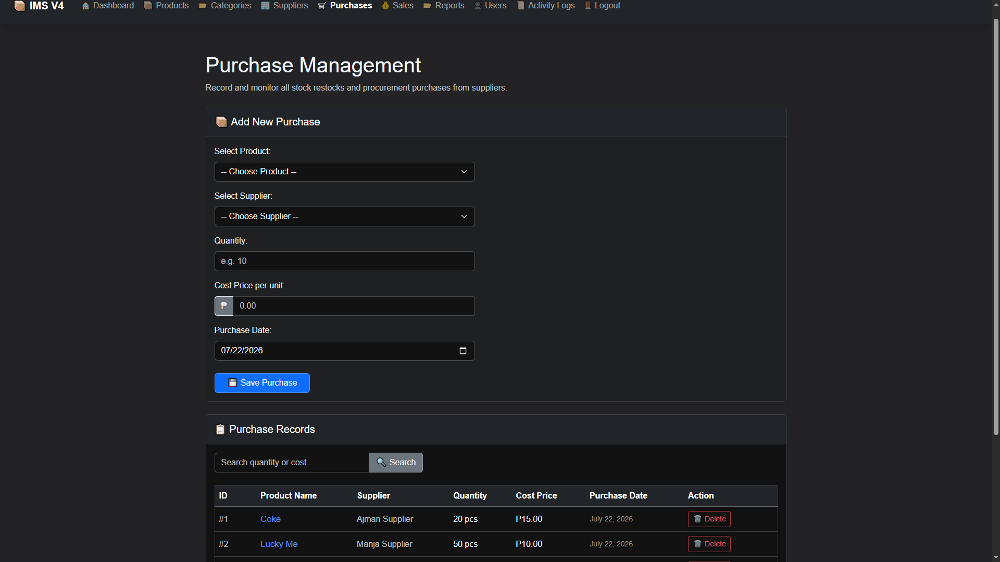
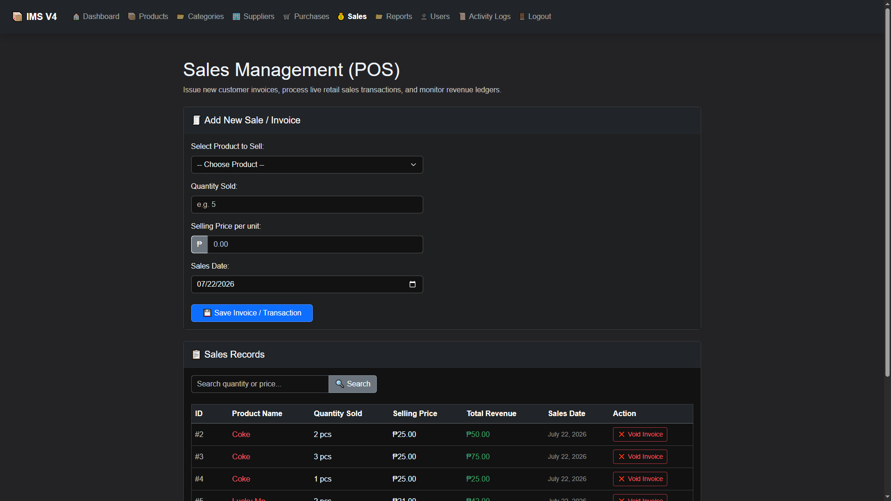
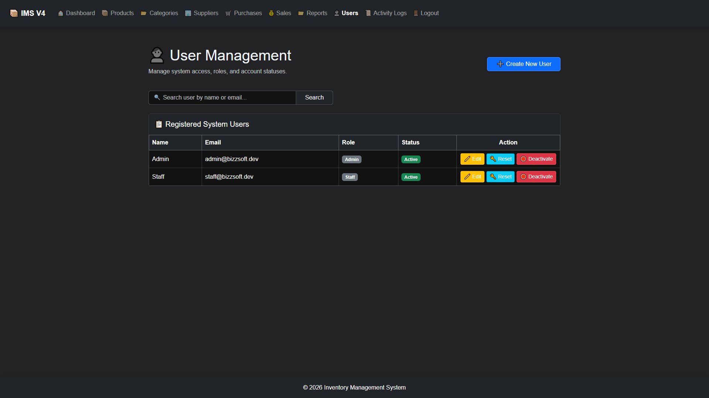
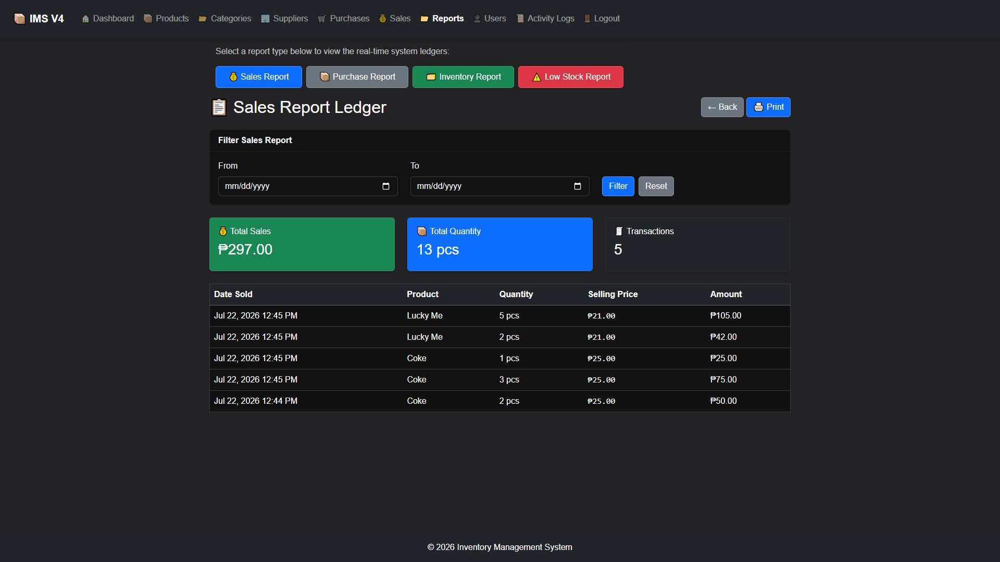
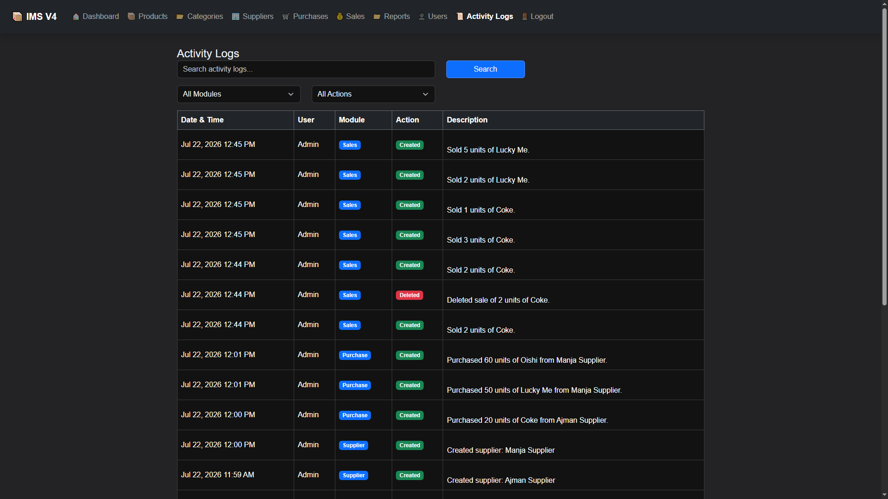

# 📦 BizzSoft Inventory Management System V4

A modern Laravel 12 Inventory Management System built using software engineering best practices, featuring Role-Based Access Control (RBAC), Activity Logs, and secure business logic.


## 📖 About

BizzSoft Inventory Management System V4 is a production-style inventory management application developed with **Laravel 12**. It was designed to demonstrate clean architecture, maintainable code, and real-world business workflows using modern software engineering practices.

The system provides complete inventory management through Product, Category, Supplier, Purchase, Sales, Reports, User Management, and Activity Logs modules. It also implements Role-Based Access Control (RBAC), database transactions, server-side business logic, and audit logging to ensure data integrity and application security.

This project was built as a portfolio application to showcase practical Laravel development skills and the application of industry-standard software engineering principles.


## ✨ Features

### 📦 Inventory Management

Manage inventory efficiently with complete CRUD operations and inventory monitoring.

* Product Management
* Category Management
* Supplier Management
* Search Functionality
* Low Stock Monitoring
* Reorder Level Tracking

### 🛒 Purchase Management

Record product purchases while automatically updating inventory levels.

* Purchase Transactions
* Automatic Stock Increase
* Historical Purchase Records
* Database Transactions for Data Integrity

### 💰 Sales Management

Process sales with built-in inventory validation and secure business logic.

* Sales Transactions
* Automatic Stock Deduction
* Stock Availability Validation
* Historical Selling Price Recording
* Automatic Line Total Calculation

### 👥 User Management

Manage system users with role-based permissions.

* User Management
* Account Status (Active / Inactive)
* Password Reset
* Role Assignment

### 🔐 Security & Software Engineering

Built using modern Laravel development practices.

* Authentication
* Role-Based Access Control (RBAC)
* Form Request Validation
* Route Model Binding
* Eloquent ORM Relationships
* Database Transactions
* Activity Logging
* Secure Server-side Business Logic

### 📊 Reports & Dashboard

Monitor business performance through real-time summaries and reports.

* Business Dashboard
* Sales Reports
* Purchase Reports
* Inventory Reports
* Recent Sales Activity
* Recent Purchase Activity
* Low Stock Summary

### 📝 Activity Logs

Track important system events for auditing and accountability.

* Product Activities
* Purchase Activities
* Sales Activities
* User Management Activities

## 🛠 Tech Stack

| Category            | Technology                                  |
| ------------------- | ------------------------------------------- |
| **Backend**         | Laravel 12, PHP 8.2                         |
| **Frontend**        | Blade, Bootstrap 5, HTML5, CSS3, JavaScript |
| **Database**        | MySQL                                       |
| **ORM**             | Eloquent ORM                                |
| **Authentication**  | Laravel Authentication                      |
| **Authorization**   | Role-Based Access Control (RBAC)            |
| **Validation**      | Laravel Form Requests                       |
| **Architecture**    | MVC (Model-View-Controller)                 |
| **Version Control** | Git & GitHub                                |
| **Deployment**      | Hostinger                                   |


## 📸 Screenshots

Below are screenshots showcasing the main features of the **BizzSoft Inventory Management System V4**.

### 📊 System Dashboard

Real-time business overview with inventory statistics, transaction summaries, and recent business activities.



---

### 📦 Product Management

Manage products with category assignment, pricing, stock monitoring, and reorder level tracking.



---

### 🛒 Purchase Management

Record purchases while automatically increasing product inventory through secure database transactions.



---

### 💰 Sales Management

Process sales with automatic stock deduction, inventory validation, historical selling price recording, and line total computation.



---

### 👥 User Management

Manage users, roles, account status, and permissions through Role-Based Access Control (RBAC).



---

### 📊 Reports

Generate business reports for sales, purchases, inventory, and stock monitoring.



---

### 📝 Activity Logs

Track important system activities including product, purchase, sales, and user management operations for auditing purposes.




## ⚙️ Installation

Follow the steps below to run the project on your local machine.

### 1. Clone the repository

```bash
git clone https://github.com/bizzcode-zzz/BizzSoft-Inventory-Management-System-V4.git
```

### 2. Navigate to the project directory

```bash
cd inventory_v4_laravel
```

### 3. Install project dependencies

```bash
composer install
```

### 4. Create the environment file

```bash
copy .env.example .env
```

### 5. Generate the application key

```bash
php artisan key:generate
```

### 6. Configure the database

Update your `.env` file with your MySQL database credentials.

Example:

```env
DB_CONNECTION=mysql
DB_HOST=127.0.0.1
DB_PORT=3306
DB_DATABASE=inventory_v4
DB_USERNAME=root
DB_PASSWORD=
```

### 7. Run database migrations

```bash
php artisan migrate
```

### 8. Seed the default system data

```bash
php artisan db:seed
```

### 9. Start the development server

```bash
php artisan serve
```

Open your browser and visit:

```text
http://127.0.0.1:8000
```

## 🔑 Default Accounts

The following accounts are available after running the database seeders.

### 👑 Administrator

| Field        | Value                                           |
| ------------ | ----------------------------------------------- |
| **Email**    | [admin@bizzsoft.dev](mailto:admin@bizzsoft.dev) |
| **Password** | password                                        |

---

### 👨‍💼 Staff

| Field        | Value                                           |
| ------------ | ----------------------------------------------- |
| **Email**    | [staff@bizzsoft.dev](mailto:staff@bizzsoft.dev) |
| **Password** | password                                        |

> **Note:** These are demo accounts created by the database seeders for testing and development purposes.

## 🏗️ System Architecture

The project follows the **Model-View-Controller (MVC)** architectural pattern provided by Laravel, promoting clean separation of concerns, maintainability, and scalability.

### Architecture Overview

* **Model** – Handles database operations using Eloquent ORM.
* **View** – Blade templates for rendering the user interface.
* **Controller** – Manages business logic and coordinates requests between models and views.

### Software Engineering Principles

* MVC (Model-View-Controller)
* Eloquent ORM
* Route Model Binding
* Form Request Validation
* Database Transactions
* Role-Based Access Control (RBAC)
* Activity Logging (Audit Trail)
* Server-side Business Logic
* Responsive Bootstrap User Interface

### Business Rules Implemented

* Automatic stock increase after purchase transactions.
* Automatic stock deduction after sales transactions.
* Stock validation prevents negative inventory.
* Historical selling prices are stored with every sales transaction.
* Line totals are calculated on the server.
* Deleted purchase transactions automatically restore stock.
* Deleted sales transactions automatically restore stock.
* User permissions are enforced through Role-Based Access Control (RBAC).
* Critical business operations are protected using database transactions.

### Project Goal

The primary objective of this project is to demonstrate the implementation of a production-style Inventory Management System using Laravel while applying software engineering best practices, secure business logic, and maintainable application architecture.


## 📂 Project Structure

The project follows Laravel's standard directory structure to keep the codebase organized and maintainable.

```text
app/
├── Http/
│   ├── Controllers/
│   └── Requests/
├── Models/
├── Services/

database/
├── migrations/
├── seeders/

public/
├── js/

resources/
├── views/
│   ├── dashboard/
│   ├── products/
│   ├── categories/
│   ├── suppliers/
│   ├── purchases/
│   ├── sales/
│   ├── reports/
│   ├── users/
│   └── activity-logs/

routes/
└── web.php

screenshots/
└── Portfolio images used in the README
```

### Project Organization

* **Controllers** handle application logic.
* **Models** interact with the database using Eloquent ORM.
* **Form Requests** centralize validation logic.
* **Services** contain reusable business services such as activity logging.
* **Blade Views** provide the user interface.
* **Routes** define application endpoints.
* **Database Migrations and Seeders** manage database structure and sample data.


## 🚀 Future Improvements

The following enhancements are planned for future versions of the system.

### 📊 Analytics & Dashboard

* Dashboard charts and business analytics
* Top-selling products
* Monthly sales trends
* Inventory value overview

### 📄 Reporting

* PDF report export
* Excel report export
* Printable reports

### 📦 Inventory

* Barcode and QR code support
* Batch inventory adjustments
* Stock movement history

### 🌐 Platform Enhancements

* REST API
* Docker support
* Cloud deployment
* Email notifications

### 🧪 Software Quality

* Unit Testing
* Feature Testing
* API Testing
* Continuous Integration (CI)

## 👨‍💻 Developer

### Alwin John P. Sitcharon

**Founder / Developer**
**BizzSoft Technologies**

Passionate about building secure, maintainable, and scalable web applications using modern software engineering practices.

### Connect

* **GitHub:** https://github.com/bizzcode-zzz

Thank you for taking the time to explore this project. Feedback, suggestions, and contributions are always welcome.

## 📄 License

This project is open-source and is available under the **MIT License**.

You are free to use, modify, and distribute this project in accordance with the terms of the MIT License.

